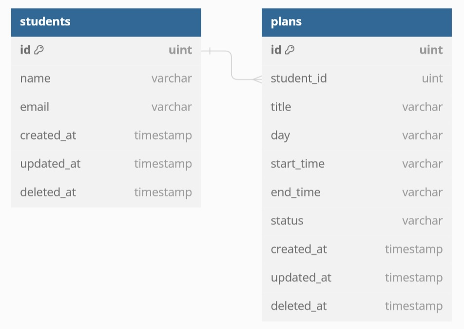

# Student Plan App

Student Plan App is a simple web application developed in Go (Golang) using the Echo framework and GORM for database operations. It allows students to manage their daily plans efficiently.

## Features

- **Plan Management:** Students can create, update, delete, and view their daily plans.
- **Conflict Detection:** The application checks for conflicts when adding or updating plans to avoid scheduling overlaps.
- **Weekly and Monthly Views:** Students can view their plans on a weekly or monthly basis for better organization.
- **User Profile:** Students can register and update their profile information.

## Technologies Used

- Go (Golang)
- Echo Framework
- GORM (Go ORM)
- MySQL Database

## Installation

- Clone the repository.
- Install dependencies using go mod tidy.
- Configure the database connection in the database.go file.
- Run the application using go run main.go.

## Usage

- Register or login as a student.
- Add, update, or delete plans as needed.
- View plans on a weekly or monthly basis.
- Update profile information if necessary.

### Db

